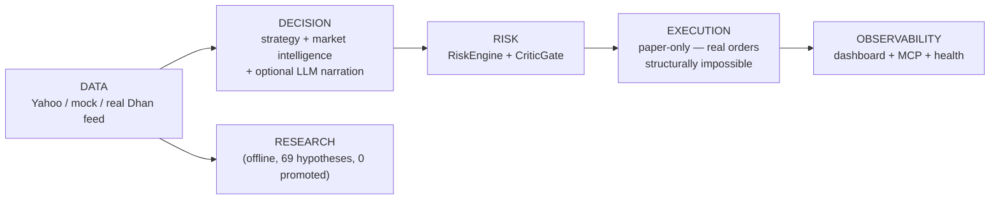

# Trading Workstation

[](https://github.com/SurathDurgaprasad/trading-workstation/actions/workflows/tests.yml)
[](LICENSE)

An end-to-end, single-user, local-first quantitative trading **research** system for
Indian (NSE/BSE) and select US equities: real market-data ingestion, a deterministic
strategy/risk/paper-execution pipeline, a rigorous offline hypothesis-testing framework,
and real live-market validation against a real broker feed — with real orders
**structurally impossible** to place.

**The headline result is a negative one, and that is the point of this repository:**
across 69 preregistered hypotheses spanning technical indicators, machine learning,
mean reversion, momentum, market-context conditioning, calendar/seasonal effects,
derivatives (futures/options), and corporate-event studies, **zero were promoted.** No
demonstrated, statistically and economically defensible trading edge exists with the
information sources tested. The research program is closed; the evidence for that
conclusion is preserved in full, not summarized away. See
[`docs/RESEARCH_RESULTS.md`](docs/RESEARCH_RESULTS.md).

This project exists to demonstrate the engineering and research discipline of building
and adversarially testing a real trading system end to end — not to sell a strategy.
Nothing here is investment advice.

## What this is

| | |
|---|---|
| **What** | A complete trading-system pipeline: market data → strategy → risk engine → (optional human approval) → paper execution, plus a separate offline research framework and a market-intelligence/decision-support pipeline. Real Dhan broker integration for live market data and read-only account state; zero real-order capability anywhere. |
| **Why** | To find out, honestly, whether a disciplined, adversarially-tested, cost-aware research process on real Indian-market data produces a defensible trading edge — and to build the full engineering scaffolding (risk controls, safety architecture, live-data validation) that any serious answer to that question requires, regardless of what the answer turns out to be. |
| **Result** | No demonstrated edge. 69 hypotheses tested, 0 promoted. See [`docs/RESEARCH_RESULTS.md`](docs/RESEARCH_RESULTS.md). |
| **Safety** | Real order execution is structurally impossible — not a disabled feature flag, but code that doesn't exist. See [`docs/SAFETY.md`](docs/SAFETY.md). |

## Architecture



Full component map, persistence model, safety invariants, and the complete diagram:
[`ARCHITECTURE.md`](ARCHITECTURE.md).

## Research: methodology and result

Every hypothesis is preregistered (signal definition, costs, success/failure criteria)
**before** its result is inspected, tested across chronological development/validation/
out-of-sample splits, cost-adjusted against a realistic NSE cost model, and checked for
leakage, survivorship bias, and multiple-testing inflation. Negative results are kept,
not discarded — the registry (`strategy/hypothesis_registry.py`) is a plain, honest
ledger of everything tried.

- **Methodology**: [`docs/RESEARCH_METHODOLOGY.md`](docs/RESEARCH_METHODOLOGY.md)
- **Results, by research program**: [`docs/RESEARCH_RESULTS.md`](docs/RESEARCH_RESULTS.md)
- **Terminal report**: [`docs/EDGE_DISCOVERY_FINAL_REPORT.md`](docs/EDGE_DISCOVERY_FINAL_REPORT.md)

## Live market validation

Six real sessions against the live Dhan NSE feed (2026-09-07 through 2026-09-23)
validated the *engineering* — connectivity, candle construction, fleet supervision,
dashboard correctness, reconnect/staleness handling — never trading profitability, and
never placed a real order. [`docs/LIVE_VALIDATION.md`](docs/LIVE_VALIDATION.md).

## Safety

No executable real-order implementation exists anywhere in this codebase — the
deliberate safety boundary in its place is `DisabledDhanOrderExecutor`, and no
configuration change can enable real-money execution, because there is no real
executor for any configuration to select.
`live/dhan/broker_adapter.py::DisabledDhanOrderExecutor` raises unconditionally from
every order-mutating method; a repository-wide search finds zero `POST`/`PUT`/`DELETE`
calls to any Dhan endpoint anywhere in this codebase; a dedicated regression test
(`tests/test_dhan_no_real_orders.py`) proves it on every change. Full detail, including
why no configuration change can bypass this: [`docs/SAFETY.md`](docs/SAFETY.md). General
security posture (credentials, dependency audit, application-layer findings):
[`SECURITY.md`](SECURITY.md).

## Running it

```bash
python -m venv venv
venv\Scripts\activate        # Windows (developed/tested platform — see docs/OPERATIONS.md)
pip install -r requirements.txt
pytest                       # full suite, no credentials required
```

```bash
python main.py backtest --symbol RELIANCE.NS          # offline research
python main.py paper-live --symbol RELIANCE.NS --interval 1d --period 1y  # offline paper trading
python main.py dashboard                                # local web UI
```

Real Dhan market data (still paper execution only — copy `.env.example` to `.env` first):

```bash
python main.py paper-live --symbol RELIANCE.NS --source dhan
```

Full walkthrough (credential setup, readiness checks, fleet operation, shutdown,
troubleshooting): [`docs/OPERATIONS.md`](docs/OPERATIONS.md). Step-by-step install:
[`INSTALLATION.md`](INSTALLATION.md). Command reference:
[`USER_GUIDE.md`](USER_GUIDE.md). Full capability-by-capability breakdown, including
which commands need credentials or consume paid API usage:
[`docs/CAPABILITIES.md`](docs/CAPABILITIES.md).

## Limitations

No demonstrated edge; no validated live profitability; no real order path; a single
retail-grade data/broker provider with no fallback; several real, disclosed data gaps
(market microstructure untestable, point-in-time universe correction applied to only
one hypothesis, no NSE earnings-date coverage). Full, candid list:
[`docs/LIMITATIONS.md`](docs/LIMITATIONS.md).

## Documentation

**Start here:**
[`ARCHITECTURE.md`](ARCHITECTURE.md) ·
[`docs/CAPABILITIES.md`](docs/CAPABILITIES.md) ·
[`docs/LIMITATIONS.md`](docs/LIMITATIONS.md) ·
[`docs/SAFETY.md`](docs/SAFETY.md) ·
[`SECURITY.md`](SECURITY.md) ·
[`docs/OPERATIONS.md`](docs/OPERATIONS.md)

**Research:**
[`docs/RESEARCH_METHODOLOGY.md`](docs/RESEARCH_METHODOLOGY.md) ·
[`docs/RESEARCH_RESULTS.md`](docs/RESEARCH_RESULTS.md) ·
[`docs/EDGE_DISCOVERY_FINAL_REPORT.md`](docs/EDGE_DISCOVERY_FINAL_REPORT.md) ·
[`docs/LIVE_VALIDATION.md`](docs/LIVE_VALIDATION.md) ·
`docs/research/` (per-hypothesis preregistrations) ·
`docs/LIVE_MARKET_VALIDATION_REPORT*.md` (per-session live reports)

**Usage:**
[`INSTALLATION.md`](INSTALLATION.md) ·
[`USER_GUIDE.md`](USER_GUIDE.md) ·
[`OPERATIONS_GUIDE.md`](OPERATIONS_GUIDE.md) (unattended operation, fleet supervision,
backup) ·
[`TROUBLESHOOTING.md`](TROUBLESHOOTING.md)

**Project history and prior audits** (each a dated, point-in-time snapshot — where a
later document disagrees with an earlier one, the later document and the `docs/`
directory's dated reports are authoritative):
[`PROJECT_GOAL_AND_ROADMAP.md`](PROJECT_GOAL_AND_ROADMAP.md) ·
[`CHANGELOG.md`](CHANGELOG.md) ·
[`docs/PHASE_HISTORY.md`](docs/PHASE_HISTORY.md) (42 numbered phases, `docs/phases/`) ·
[`docs/FINAL_PRODUCT_READINESS_REPORT.md`](docs/FINAL_PRODUCT_READINESS_REPORT.md) /
[`docs/FINAL_PRODUCT_CAPABILITY_MATRIX.md`](docs/FINAL_PRODUCT_CAPABILITY_MATRIX.md) ·
[`FINAL_FAILURE_MODE_ANALYSIS.md`](FINAL_FAILURE_MODE_ANALYSIS.md) (53 evidence-labeled
failure scenarios) ·
[`docs/FINAL_ADVERSARIAL_ENGINEERING_AUDIT.md`](docs/FINAL_ADVERSARIAL_ENGINEERING_AUDIT.md) ·
[`docs/TRADING_STRATEGY_READINESS.md`](docs/TRADING_STRATEGY_READINESS.md) ·
[`docs/MASTER_KNOWN_ISSUES.md`](docs/MASTER_KNOWN_ISSUES.md) (current open items) ·
[`docs/PUBLIC_RELEASE_AUDIT.md`](docs/PUBLIC_RELEASE_AUDIT.md) (this public release's own
security/reproducibility audit)

## Contributing

See [`CONTRIBUTING.md`](CONTRIBUTING.md) — a personal project, not a maintained
product, but genuine contributions are welcome within the ground rules there
(never weaken the safety architecture, never commit a credential, preregister new
research).

## License

[MIT](LICENSE), with an additional explicit disclaimer: this is research software, not
investment advice, and has no demonstrated trading edge. See the LICENSE file for the
full text.
